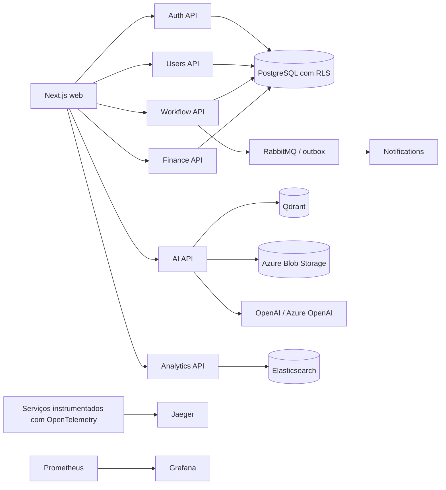

# Arquitetura

## Estado

A estrutura abaixo é o limite arquitetural planejado. Apenas `apps/web`, `services/auth` (bootstrap HTTP sem autenticação) e `packages/shared`/`packages/ui` possuem implementação inicial. Os outros contextos estão documentados, não implementados.

## Limites e contratos

- Cada diretório em `services/` representa um bounded context e propriedade de dados ainda a definir. Um serviço não deve ler tabelas de outro serviço diretamente.
- REST versionada é o contrato síncrono; eventos de domínio publicados após commit são o contrato assíncrono. Ainda não existem broker, schema registry, outbox ou política de compatibilidade implementados.
- CQRS é adotado apenas quando leitura/escrita assimétricas justificarem projeções dedicadas; não é requisito para duplicar cada tabela ou endpoint.
- Dados transacionais residem no PostgreSQL. Cache, busca, vetores e blobs são projeções/referências reconstruíveis, não fontes de verdade.
- Tenant e ator devem vir de claims verificadas e membership autorizada. Um header de tenant fornecido pelo cliente nunca é prova de autorização.

## Fluxo de request

1. O edge valida TLS, limites de tamanho e identidade do request.
2. O serviço valida JWT, membership, permissões e atributos do recurso.
3. Uma transação define `app.tenant_id`, `app.actor_id`, `app.client_ip` e `app.device_info` com `SET LOCAL` antes de qualquer consulta RLS.
4. Escritas de estado e evento de outbox são confirmados na mesma transação.
5. Workers idempotentes publicam/consomem eventos e atualizam projeções. Logs e traces carregam IDs de correlação, nunca conteúdo sensível.

Esse fluxo é uma decisão arquitetural, não comportamento já ligado ao código.